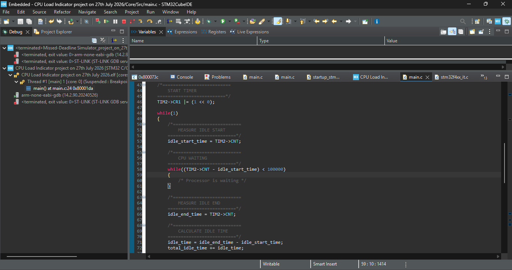

# CPU Load Indicator using STM32F401CCU6

## Project Overview

This project demonstrates the concept of CPU utilization using the STM32F401CCU6 microcontroller and the TIM2 hardware timer. The objective is to estimate how busy the processor is by measuring the amount of time it spends executing a task (Busy Time) versus the time it spends waiting before the next task begins (Idle Time).

A free-running hardware timer is used as a stopwatch throughout the program. Instead of starting and stopping the timer, the current counter value is read before and after different sections of the program to determine the elapsed time.

The measured busy and idle times are accumulated continuously, and the CPU utilization is calculated using the formula:

```
CPU Utilization (%) =
(Total Busy Time × 100) /
(Total Busy Time + Total Idle Time)
```

An LED connected to PA6 is used as a simple processor load indicator. If the calculated CPU utilization reaches or exceeds 50%, the LED turns ON; otherwise, it remains OFF.

## Project Code
[Click here to check out the project code](code)

## Project Image


## Features

- Bare-metal STM32 register programming
- TIM2 configured as a free-running hardware timer
- Busy time measurement
- Simulated idle time measurement
- CPU utilization calculation
- LED status indication based on processor workload

## Hardware Required

- STM32F401CCU6 Black Pill
- ST-Link V2 Programmer
- LED ×1
- 220 Ω Resistor ×1
- Jumper Wires

## Circuit Connection

| Component | STM32 Pin |
|----------|----------|
| LED Anode (+) | PA6 |
| LED Cathode (-) | 220 Ω → GND |
| ST-Link SWDIO | PA13 |
| ST-Link SWCLK | PA14 |
| 3.3V | 3.3V |
| GND | GND |

## How It Works

1. GPIOA and TIM2 are initialized.
2. TIM2 is configured as a continuously running timer.
3. The processor records the beginning and end of a simulated waiting period to determine the idle time.
4. The processor then records the beginning and end of a simulated task to determine the busy time.
5. Both measurements are accumulated throughout program execution.
6. CPU utilization is calculated from the accumulated busy and idle times.
7. The LED indicates whether the processor load is above or below the defined threshold.

## Learning Outcomes

Through this project, I learned:

- How to configure and use a hardware timer as a time reference.
- How execution time can be measured using timer timestamps.
- The relationship between busy time, idle time, and CPU utilization.
- How processor workload can be estimated using timing measurements.
- The difference between measuring a single task's execution time and monitoring overall processor activity.

## Project Note

The idle period used in this project is intentionally simulated for educational purposes to demonstrate the concept of CPU utilization. In a production embedded system or an RTOS, idle time is typically measured when no application tasks are ready to execute, often using an idle task or low-power instructions such as `WFI` (Wait For Interrupt). This project focuses on understanding the timing principles behind CPU load estimation rather than implementing a complete operating system scheduler.

## Author

**Moses Kolawole**
